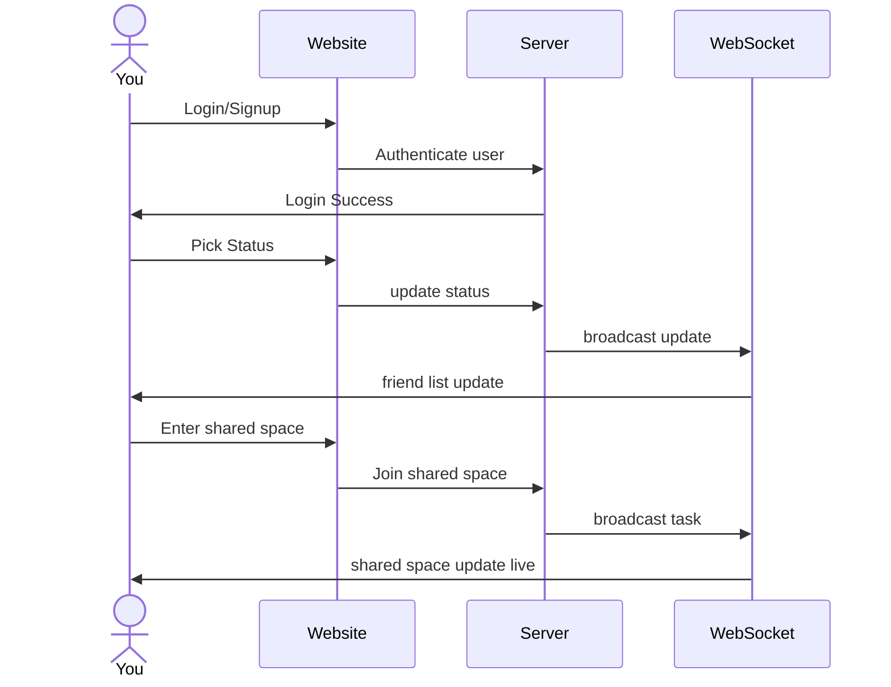

# StatusTag

[My Notes](notes.md)

I plan to develop a web application where users can select their current status (e.g., open to talk, eating lunch, in class, TA, or at the library) and view their friends’ current statuses. The application also includes a shared area where users can see each other’s avatars and the specific tasks they are working on in real time. 

## 🚀 Specification Deliverable

For this deliverable I did the following. I checked the box `[x]` and added a description for things I completed.

- [x] Proper use of Markdown
- [x] A concise and compelling elevator pitch
- [x] Description of key features
- [x] Description of how you will use each technology
- [x] One or more rough sketches of your application. Images must be embedded in this file using Markdown image references.

### Elevator pitch
College students often have fragmented schedule, making it difficult to know whether friends are available in a given moment. This app allows users to share simple status updates so friends can understand each other’s availability without initiating a conversation. Even when busy, users can feel connected through shared study or activity spaces represented by virtual avatars.

### Design

### Key features

- Users can regist or login and select one or more status tags
- Users can see other's friends status and last updated time
- Users can enter a shared study/play space with personal avatar
- Users can write small task which will update to other people in the shared space. 

### Technologies

I am going to use the required technologies in the following ways.

- **HTML** - it builds the page which displays. It includes login page, main page(choose statu) and shared study space. 
- **CSS** - It keeps the UI looks great with a clean layout.
- **React** - It implements UI components and routing.
- **Service** - It processes the statistics and passes to other parts
- **DB/Login** - It remembers all the statistics.
- **WebSocket** - It keeps real-time updates without refreshing. 

## 🚀 AWS deliverable

For this deliverable I did the following. I checked the box `[x]` and added a description for things I completed.

- [x] **Server deployed and accessible with custom domain name** - [My server link](https://startup.xinlin260.click/).

## 🚀 HTML deliverable

For this deliverable I did the following. I checked the box `[x]` and added a description for things I completed.

- [x] **HTML pages** - Function well with requirement
- [x] **Proper HTML element usage** - Proper use of sturcture in every pages
- [x] **Links** - Each page has links to GitHub
- [x] **Text** - Each page has short text decribing 
- [x] **3rd party API placeholder** - have it on about.html
- [x] **Images** - Have at least one page
- [x] **Login placeholder** - Login on index.html
- [x] **DB data placeholder** - Have data in space.html
- [x] **WebSocket placeholder** - Have it in status.html

## 🚀 CSS deliverable

For this deliverable I did the following. I checked the box `[x]` and added a description for things I completed.

- [x] **Visually appealing colors and layout. No overflowing elements.** - I complete it
- [x] **Use of a CSS framework** - I use it well.
- [x] **All visual elements styled using CSS** - I use it well.
- [x] **Responsive to window resizing using flexbox and/or grid display** - I use it in flex and grid
- [x] **Use of a imported font** - I use imported font in index.html
- [x] **Use of different types of selectors including element, class, ID, and pseudo selectors** - I use different selectors.

## 🚀 React part 1: Routing deliverable

For this deliverable I did the following. I checked the box `[x]` and added a description for things I completed.

- [ ] **Bundled using Vite** - I did not complete this part of the deliverable.
- [ ] **Components** - I did not complete this part of the deliverable.
- [ ] **Router** - I did not complete this part of the deliverable.

## 🚀 React part 2: Reactivity deliverable

For this deliverable I did the following. I checked the box `[x]` and added a description for things I completed.

- [ ] **All functionality implemented or mocked out** - I did not complete this part of the deliverable.
- [ ] **Hooks** - I did not complete this part of the deliverable.

## 🚀 Service deliverable

For this deliverable I did the following. I checked the box `[x]` and added a description for things I completed.

- [ ] **Node.js/Express HTTP service** - I did not complete this part of the deliverable.
- [ ] **Static middleware for frontend** - I did not complete this part of the deliverable.
- [ ] **Calls to third party endpoints** - I did not complete this part of the deliverable.
- [ ] **Backend service endpoints** - I did not complete this part of the deliverable.
- [ ] **Frontend calls service endpoints** - I did not complete this part of the deliverable.
- [ ] **Supports registration, login, logout, and restricted endpoint** - I did not complete this part of the deliverable.

## 🚀 DB deliverable

For this deliverable I did the following. I checked the box `[x]` and added a description for things I completed.

- [ ] **Stores data in MongoDB** - I did not complete this part of the deliverable.
- [ ] **Stores credentials in MongoDB** - I did not complete this part of the deliverable.

## 🚀 WebSocket deliverable

For this deliverable I did the following. I checked the box `[x]` and added a description for things I completed.

- [ ] **Backend listens for WebSocket connection** - I did not complete this part of the deliverable.
- [ ] **Frontend makes WebSocket connection** - I did not complete this part of the deliverable.
- [ ] **Data sent over WebSocket connection** - I did not complete this part of the deliverable.
- [ ] **WebSocket data displayed** - I did not complete this part of the deliverable.
- [ ] **Application is fully functional** - I did not complete this part of the deliverable.
