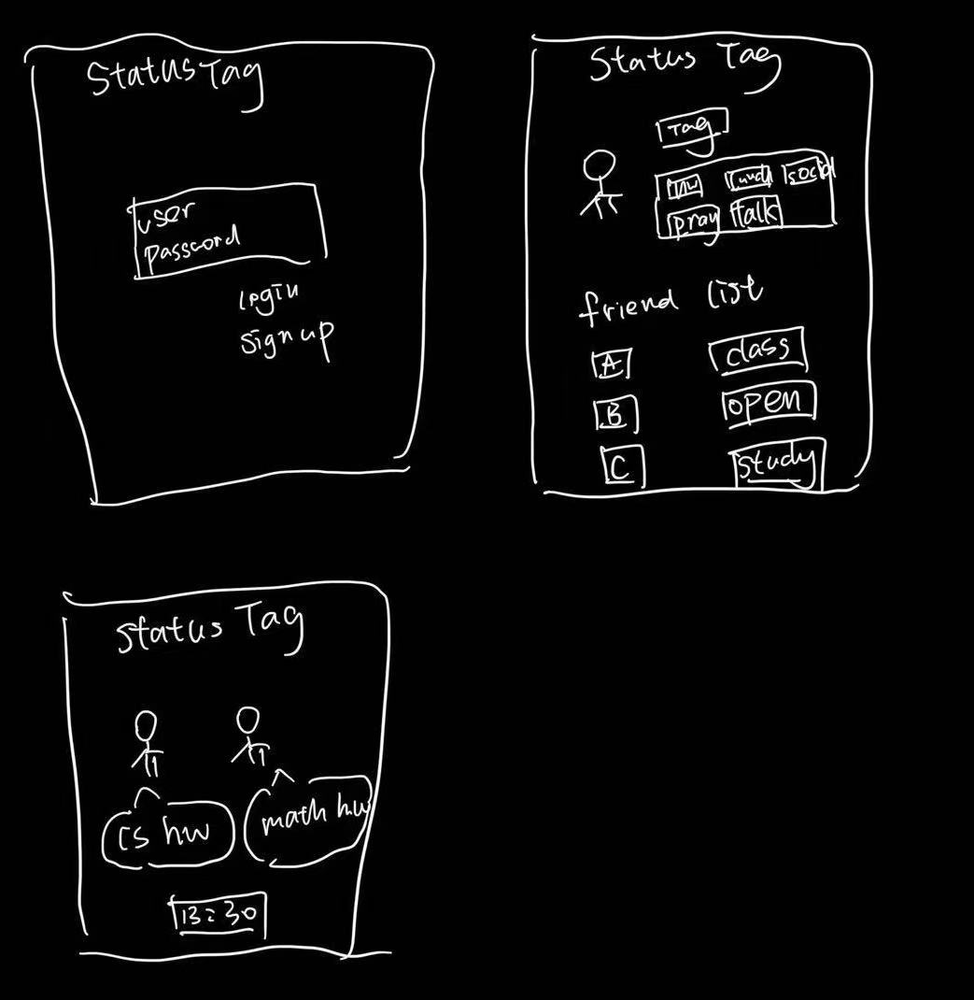
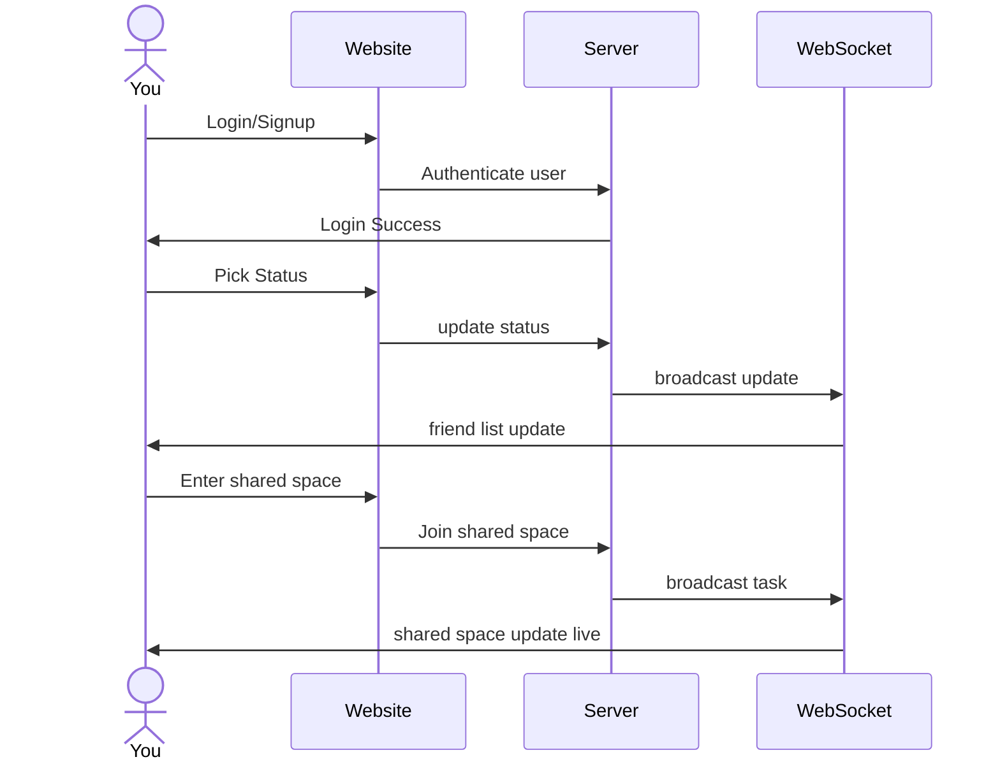

# StatusTag

[My Notes](notes.md)

I plan to develop a web application where users can select their current status (e.g., open to talk, eating lunch, in class, TA, or at the library) and view their friends’ current statuses. The application also includes a shared area where users can see each other’s avatars and the specific tasks they are working on in real time. 

## 🚀 Specification Deliverable

For this deliverable I did the following. I checked the box `[x]` and added a description for things I completed.

- [x] Proper use of Markdown
- [x] A concise and compelling elevator pitch
- [x] Description of key features
- [x] Description of how you will use each technology
- [x] One or more rough sketches of your application. Images must be embedded in this file using Markdown image references.

### Elevator pitch
College students often have fragmented schedule, making it difficult to know whether friends are available in a given moment. This app allows users to share simple status updates so friends can understand each other’s availability without initiating a conversation. Even when busy, users can feel connected through shared study or activity spaces represented by virtual avatars.

### Design

```mermaid
sequenceDiagram
    actor You
    participant Website
    participant Server
    participant WS as WebSocket

    You->>Website: Login/Signup
    Website->>Server: Authenticate user
    Server->>You: Login Success

    You->>Website: Pick Status
    Website->>Server: update status
    Server->>WS: broadcast update
    WS->>You: friend list update

    You->>Website: Enter shared space
    Website->>Server: Join shared space
    Server->>WS: broadcast task
    WS->>You: shared space update live


```

### Key features

- Users can regist or login and select one or more status tags
- Users can see other's friends status and last updated time
- Users can enter a shared study/play space with personal avatar
- Users can write small task which will update to other people in the shared space. 

### Technologies

I am going to use the required technologies in the following ways.

- **HTML** - it builds the page which displays. It includes login page, main page(choose statu) and shared study space. 
- **CSS** - It keeps the UI looks great with a clean layout.
- **React** - It implements UI components and routing.
- **Service** - It processes the statistics and passes to other parts
- **DB/Login** - It remembers all the statistics.
- **WebSocket** - It keeps real-time updates without refreshing. 

## 🚀 AWS deliverable

For this deliverable I did the following. I checked the box `[x]` and added a description for things I completed.

- [x] **Server deployed and accessible with custom domain name** - [My server link](https://startup.xinlin260.click/).

## 🚀 HTML deliverable

For this deliverable I did the following. I checked the box `[x]` and added a description for things I completed.

- [x] **HTML pages** - Function well with requirement
- [x] **Proper HTML element usage** - Proper use of sturcture in every pages
- [x] **Links** - Each page has links to GitHub
- [x] **Text** - Each page has short text decribing 
- [x] **3rd party API placeholder** - have it on about.html
- [x] **Images** - Have at least one page
- [x] **Login placeholder** - Login on index.html
- [x] **DB data placeholder** - Have data in space.html
- [x] **WebSocket placeholder** - Have it in status.html

## 🚀 CSS deliverable

For this deliverable I did the following. I checked the box `[x]` and added a description for things I completed.

- [x] **Visually appealing colors and layout. No overflowing elements.** - I complete it
- [x] **Use of a CSS framework** - I use it well.
- [x] **All visual elements styled using CSS** - I use it well.
- [x] **Responsive to window resizing using flexbox and/or grid display** - I use it in flex and grid
- [x] **Use of a imported font** - I use imported font in index.html
- [x] **Use of different types of selectors including element, class, ID, and pseudo selectors** - I use different selectors.

## 🚀 React part 1: Routing deliverable

For this deliverable I did the following. I checked the box `[x]` and added a description for things I completed.

- [x] **Bundled using Vite** - Easy complete it
- [x] **Components** - Got it
- [x] **Router** - Have router

## 🚀 React part 2: Reactivity deliverable

For this deliverable I did the following. I checked the box `[x]` and added a description for things I completed.

- [x] **All functionality implemented or mocked out** - All pages function perfect.
- [x] **Hooks** - I have well usage of useeffect, usestate and setinterval. The loginin page function perfectly. The status page contain a chart that updates the user's information with mock users. It also contains changeable buttons which updates in local storage. The space page contains setinterval, it also gets data from localstorage that updates with the status page. 

## 🚀 Service deliverable

For this deliverable I did the following. I checked the box `[x]` and added a description for things I completed.

- [x] **Node.js/Express HTTP service** - I already creat the HTTP server in node.js
- [x] **Static middleware for frontend** - I add express.static(public) in node.js
- [x] **Calls to third party endpoints** - I have a quote third party api in about page
- [x] **Backend service endpoints** - I have api in backend in node.js for create, login, logout, status, etc. 
- [x] **Frontend calls service endpoints** - My frontend like space.jsx and status.jsx and login.jsx connect backend by fetch.
- [x] **Supports registration, login, logout, and restricted endpoint** - I have api login, create, verifyAuth, and bcrypt. 

## 🚀 DB deliverable

For this deliverable I did the following. I checked the box `[x]` and added a description for things I completed.

- [x] **Stores data in MongoDB** - I successfully connect my backend with MongoDB, store the data from my web in Mongo. 
- [x] **Stores credentials in MongoDB** - I successfully make my login connect with MongoDB as well. 

## 🚀 WebSocket deliverable

For this deliverable I did the following. I checked the box `[x]` and added a description for things I completed.

- [x] **Backend listens for WebSocket connection** - The post/status in my service-index.js connects with websocket. 
- [x] **Frontend makes WebSocket connection** - The status.jsx connect with websocket to make live changes about status. 
- [x] **Data sent over WebSocket connection** - The service-peerProxy.js is responsible for the websocket connection for each user. 
- [x] **WebSocket data displayed** - The status.jsx will react.useeffect the updated statu and display the change in the friend statu chart. 
- [x] **Application is fully functional** - The overall function is fully functinal.
